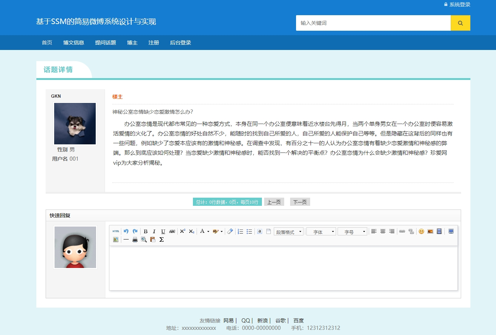
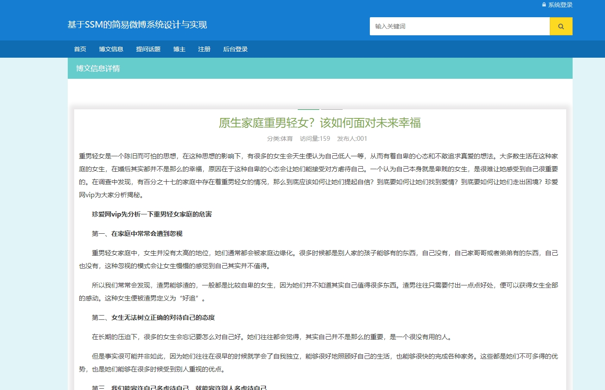
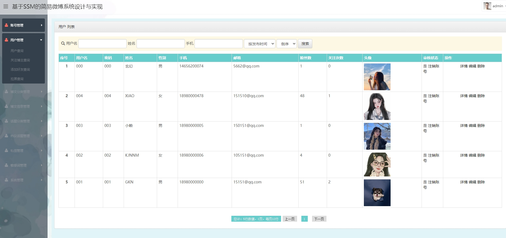
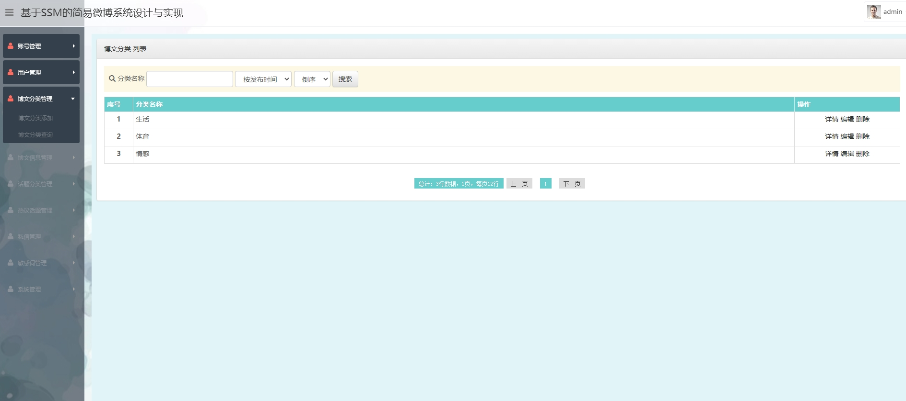
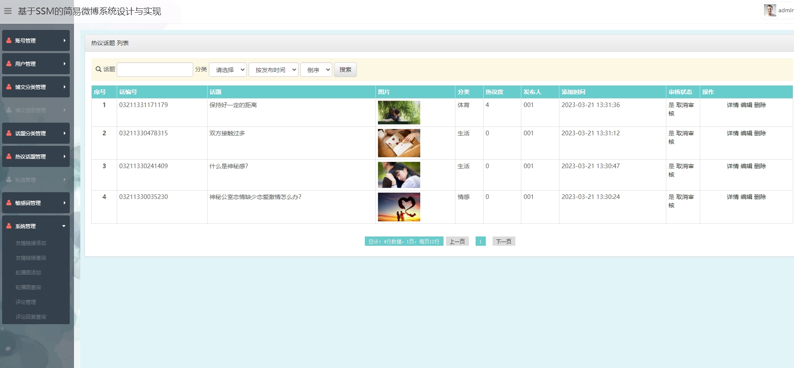
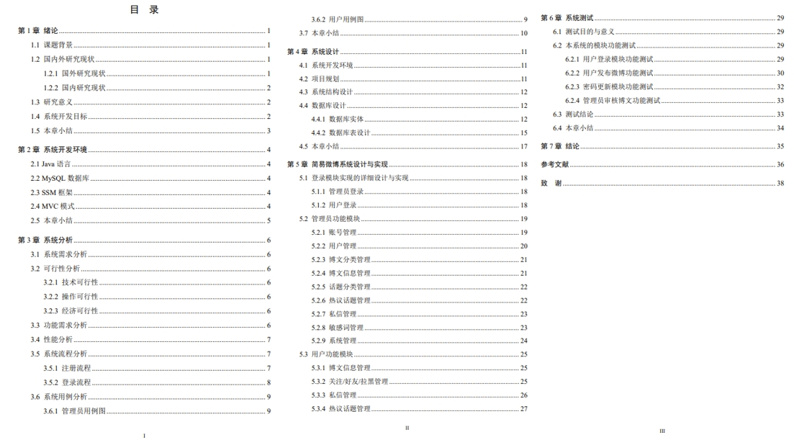

# 1项目介绍
- 系统角色：管理员、普通用户
- 功能模块：管理员（用户管理，博文分类管理，博文信息管理，话题分类管理，热议话题管理，私信管理，敏感词管理，系统管理等），普通用户（登录注册，个人中心，热议话题，私信，关注/好友管理、博文信息管理等）
- 技术选型：SSM，jsp等
- 测试环境：idea2024，tomcat8，jdk8，mysql5.7等
# 2.项目部署
- 创建数据库，导入sql
- 通过idea打开项目，根据本地数据库环境配置src/resources/jdbc.properties 1-6行
- 右键WebRoot/WEB-INF/lib，选择add as lib…
- 配置tomcat，并启动
- http://localhost:8080/， 相关账号密码查看数据库
# 3.项目部分截图

# 4.获取方式
[戳我查看](https://gitee.com/aven999/mall)
